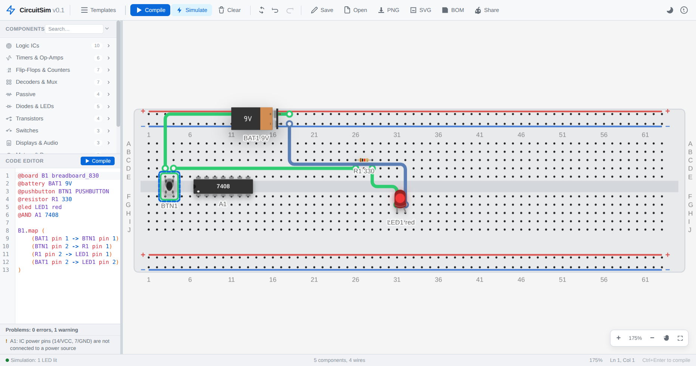
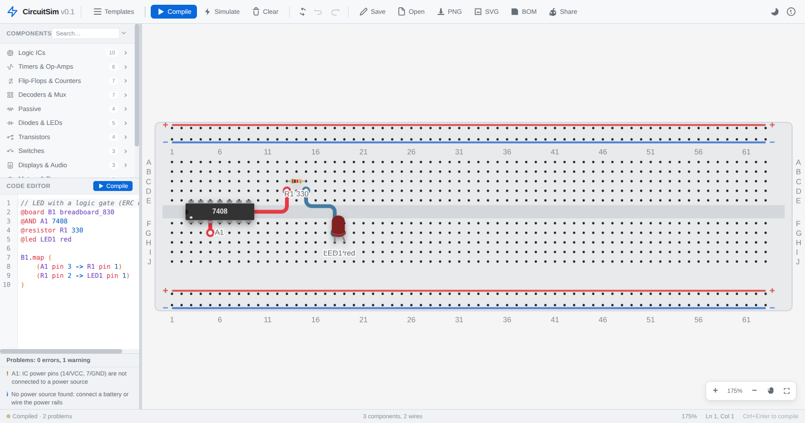
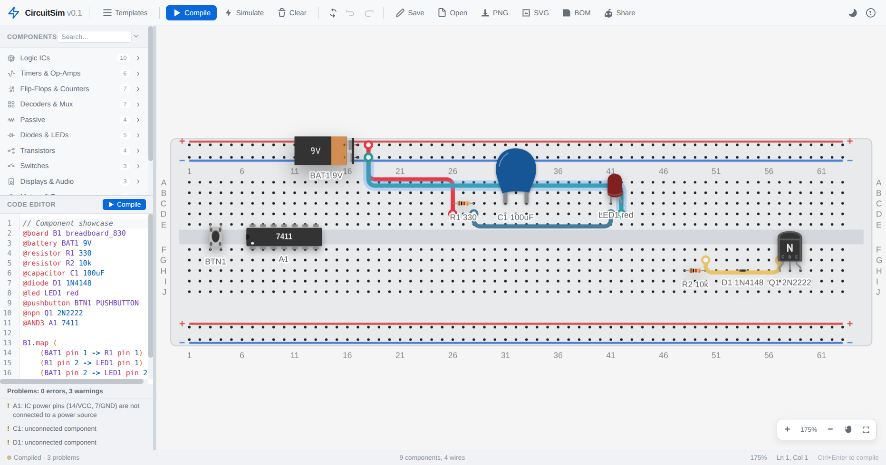
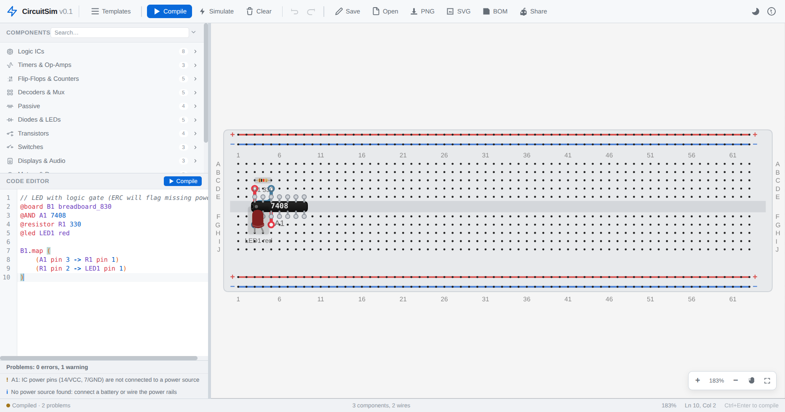

# CircuitSim

**Write a circuit in code, watch it land on a breadboard, simulate it, and export it.** CircuitSim is a small domain-specific language for describing electronic circuits with real 74xx ICs, a compiler that places every part on a virtual 830-point breadboard, a digital simulator that lights the LEDs, and an electrical rule check that catches wiring mistakes before you build them.



## What it does

**Compile a DSL.** Declare components and connections in a readable syntax; the compiler resolves IC pinouts, places parts on the breadboard and routes the wires. Multiple breadboards are supported, each with its own components, joined by jumper wires.

**Simulate the result.** Toggle Simulate and the canvas comes alive: wires turn green for logic high and blue for logic low, LEDs glow, buzzers show sound arcs, and oscillating circuits are reported instead of hanging.

**Catch mistakes early.** The ERC flags shorted nets, disconnected IC power pins, LEDs without series resistors, floating parts, output contention and missing power sources, right under the editor.

**Work visually.** Drag components and wires; they snap to holes with magnetic feedback. Undo/redo, autosave, fit-to-view, panning and touch gestures are all built in.

**Share and export.** Full-circuit PNG, vector SVG, a grouped BOM as CSV, and permalinks that encode the whole circuit in the URL.

## Quick start

```bash
# 1. Clone
git clone https://github.com/Ahsaniat/Circuit-Sim.git
cd Circuit-Sim

# 2. Build the C++ compiler and run its tests
cmake -S . -B build -DBUILD_TESTS=ON -DCMAKE_BUILD_TYPE=Release
cmake --build build -j1                      # -j1 keeps low-memory machines happy
ctest --test-dir build --output-on-failure

# 3. Compile a circuit from the CLI
./build/circuitsim tests/conformance/led-basic.ok.csim

# 4. Run the web app
cd web
npm ci
npm run dev        # http://localhost:5173
```

| Command | What it does |
| :--- | :--- |
| `npm run dev` | Start the Vite dev server with hot reload |
| `npm test` | Run the Vitest suite (compiler, geometry, simulation, ERC, exports) |
| `npm run typecheck` | TypeScript strict check |
| `npm run build` | Typecheck and produce a production bundle in `web/dist` |
| `ctest --test-dir build` | Run the C++ compiler test suite |

## The language

```csim
// Battery + LED with current-limiting resistor
@battery BAT1 9V
@resistor R1 330
@led LED1 red
@board B1 breadboard_830

map (
    (BAT1 pin 1 -> R1 pin 1)
    (R1 pin 2 -> LED1 pin 1)
    (BAT1 pin 2 -> LED1 pin 2)
)
```

| Concept | Syntax | Notes |
| :--- | :--- | :--- |
| Component | `@keyword ID [value]` | Values keep their units: `10k`, `4.7k`, `100uF`, `16MHz` |
| Board | `@board ID breadboard_830` | 830, 400 and 170-point breadboards; several boards sit side by side |
| Connection | `(SRC pin N -> DST pin M, ...)` | Multiple destinations per source; cross-board jumpers allowed |
| Board scoping | `B1.map ( ... )` | Components first referenced in the block are placed on B1 |
| Explicit placement | `place R1, LED1 on B2` | Authoritative over scoped maps |
| Custom IC | `def MyIC (A -> input, B -> output)` | Pin names and directions feed tooltips and ERC |
| Comments | `// ...` | Layout metadata is stored in a trailing `//!layout:` comment |

**Full syntax, every keyword and the board/wiring rules live in the
[Language Reference](__docs__/LANGUAGE_REFERENCE.md).**

<details>
<summary><b>Component keywords</b></summary>

| Category | Keywords |
| :--- | :--- |
| Logic gates | `@AND` `@OR` `@NOT` `@NAND` `@NOR` `@XOR` `@AND3` `@NAND3` `@NOR3` `@AND4` `@NAND4` |
| MSI | `@mux_4x1` `@mux_8x1` `@decoder_3to8` `@decoder_2to4` `@encoder_8to3` `@shift_reg_8` `@d_flipflop` `@jk_flipflop` `@latch_8` `@counter_4bit` `@counter_decade` |
| Passives | `@resistor` `@capacitor` `@inductor` `@potentiometer` |
| Diodes & LEDs | `@diode` `@zener_diode` `@schottky_diode` `@led` `@ir_led` `@photodiode` `@ldr` |
| Transistors | `@npn` `@pnp` `@nmos` `@pmos` |
| Switches | `@switch_spst` `@switch_spdt` `@pushbutton` |
| Displays & audio | `@display_7seg` `@buzzer` `@passive_buzzer` |
| Motors & power | `@motor_dc` `@servo` `@battery` `@regulator` `@crystal` |
| Generic | `@comp ID 7408` for any built-in IC number |

</details>

## Simulation and ERC

The simulator extracts an electrical netlist from the physical placement — column halves, full-width power rails, pins, wires, closed switches and battery terminals — then evaluates to a fixed point with four values: `0`, `1`, `X` (unknown/conflict) and `Z` (floating).

| Status | Components |
| :--- | :--- |
| Fully modelled | 7400, 7402, 7404, 7408, 7410, 7411, 7420, 7421, 7427, 7432, 7486 gates, LEDs, buzzers, resistors, inductors, switches (open), batteries |
| Reported as unsupported | 555 timer, counters, flip-flops, op-amps, displays (shown in ERC, outputs treated as unknown) |

## Screenshots

**ERC diagnostics** — problems appear under the editor and in the status bar.



**Net highlighting** — hovering a wire lights up its whole electrical net.



**Light theme** — the canvas follows the theme through CSS custom properties.



<details>
<summary><b>More screenshots</b></summary>

| Screenshot | Shows |
| :--- | :--- |
| [icons-and-drag.png](__docs__/screenshots/icons-and-drag.png) | Tabler Icons palette, BOM/Share toolbar, a dragged wire |
| [simulation-led.png](__docs__/screenshots/simulation-led.png) | Simulation overlay on a battery + LED circuit |
| [inline-error.png](__docs__/screenshots/inline-error.png) | Inline compile diagnostics in the editor |
| [dark-canvas.png](__docs__/screenshots/dark-canvas.png) | Dark theme canvas |
| [app-editor.png](__docs__/screenshots/app-editor.png) | Early editor screenshot (pre-CodeMirror) |

</details>

## Architecture

The dependency arrow points one way: the UI depends on the compiler and simulation, never the reverse.

| Layer | Location | Responsibility |
| :--- | :--- | :--- |
| DSL compiler (C++) | `src/lexer` `src/parser` `src/semantic` `src/ir` | CLI compiler with diagnostics and JSON IR |
| DSL compiler (web) | `web/src/compiler` | Browser compiler with the same grammar and error semantics |
| Geometry | `web/src/geometry` | Breadboard coordinates, footprints, magnetic snapping |
| Simulation | `web/src/simulation` | Netlist extraction and digital fixed-point solver |
| ERC | `web/src/erc` | Electrical rule checks |
| Rendering | `web/src/renderer` | Canvas scene, interaction, exports |
| UI | `web/src/ui` | CodeMirror editor, palette, panels, theme |

<details>
<summary><b>Compiler pipeline</b></summary>

```
source → lexer → parser → semantic validation → IR generation → JSON / canvas scene
```

Both compilers are exercised against the same fixtures in `tests/conformance/`: files ending `.ok.csim` must compile, files ending `.err.csim` must fail. This keeps the two implementations honest without duplicating test suites.

</details>

## Development

| Task | Command |
| :--- | :--- |
| Watch mode tests | `npm run test:watch` (in `web/`) |
| C++ tests | `cmake --build build -j1 && ctest --test-dir build` |
| Memory watcher (local) | `nohup scripts/dev/memwatch.sh &` writes `logs/memwatch.log` |

CI runs the C++ build and tests, the TypeScript typecheck, the web test suite and a production build on every push and pull request.

## Roadmap

Not implemented yet, tracked honestly: simulation models for the 555, counters and flip-flops; interactive switch toggling; SPICE netlist export; PWA/offline install; guided lessons; a visual custom-IC editor. The ERC panel lists every IC that currently lacks a model.

## License

MIT — see [LICENSE](LICENSE). Bundled third-party assets and their licenses are listed in [THIRD_PARTY_NOTICES.md](THIRD_PARTY_NOTICES.md).
